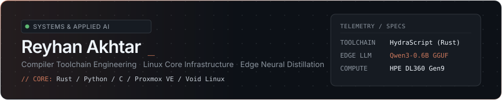

<!-- [xihanzu-NR] -->
<div align="center">

<picture>
  <source media="(prefers-color-scheme: dark)" srcset="assets/hero-dark.svg">
  <source media="(prefers-color-scheme: light)" srcset="assets/hero-light.svg">
  
</picture>

<br/><br/>

[](https://github.com/hanxthvy/hydrascript)
[](https://github.com/hanxthvy/hydrascript-llm)
[](https://github.com/hanxthvy/portfolio)
[](mailto:contact@hanz.dev)

</div>

<br/>

### ⚡ Flagship Systems & Open-Source

<table>
  <thead>
    <tr>
      <th width="32%">Project</th>
      <th width="48%">Architecture &amp; Execution</th>
      <th width="20%">Key Metrics</th>
    </tr>
  </thead>
  <tbody>
    <tr>
      <td>
        <a href="https://github.com/hanxthvy/hydrascript"><b>HydraScript Compiler</b></a><br/>
        <code>Rust</code> · <code>AST Lexer</code> · <code>Transpiler</code>
      </td>
      <td>
        Standalone native compiler written in Rust that compiles clean Pythonic syntax directly to React (<code>.hyx</code>) and Node.js ES Modules (<code>.hys</code>). Eliminates JSX angle-bracket boilerplate with zero runtime performance cost.
      </td>
      <td>
        <code>~1.4ms</code> compilation<br/>
        <code>0</code> runtime overhead<br/>
        <code>100%</code> native binary
      </td>
    </tr>
    <tr>
      <td>
        <a href="https://github.com/hanxthvy/hydrascript-llm"><b>HydraScript LLM</b></a><br/>
        <code>Qwen3</code> · <code>LoRA</code> · <code>GGUF</code> · <code>llama.cpp</code>
      </td>
      <td>
        Specialized code language model fine-tuned on 6,965 synthetic pairs across 38 language segments. Synthesized code continuously validates against <code>hydra --check</code> AST verification loop. Quantized to GGUF Q8_0 for edge CPU inference.
      </td>
      <td>
        <code>6,965</code> samples<br/>
        <code>0.6B</code> parameter base<br/>
        <code>Q8_0</code> GGUF CPU
      </td>
    </tr>
    <tr>
      <td>
        <a href="https://github.com/hanxthvy/portfolio"><b>Hydra Developer Portfolio</b></a><br/>
        <code>HydraScript</code> · <code>Tailwind</code> · <code>GSAP</code>
      </td>
      <td>
        Production web application authored entirely in pure HydraScript (<code>.hyx</code>/<code>.hys</code>). Features Alight Motion wave exit splash screen, custom Hermite smoothstep scroll suspension, and zero-FOUC theme tokens.
      </td>
      <td>
        <code>100%</code> HydraScript<br/>
        <code>0</code> JS/TS source files<br/>
        <code>400ms</code> crossfade
      </td>
    </tr>
  </tbody>
</table>

<br/>

### 🖥️ Physical Compute & Network Infrastructure

```
[ Residential LAN / CGNAT ]                                  [ Public Gateway ]
       │                                                             │
  HPE DL360 Gen9 ──── Proxmox VE ──── WireGuard Mesh Tunnel ────► Public VPS Gateway
  (1U Xeon / ECC)      (LXC / VMs)       (Full CGNAT Bypass)      (Reverse Proxy / Edge)
```

* **Physical Compute**: 1U Enterprise Rack Server **HPE ProLiant DL360 Gen9** (Intel Xeon E5 v4, ECC DDR4 Registered Memory) hosted in personal homelab.
* **Virtualization Layer**: **Proxmox VE** hypervisor running Debian/Ubuntu kernel instances and lightweight LXC application containers.
* **Network Topology**: WireGuard mesh tunnel bridging residential CGNAT networks directly to public VPS gateways with zero port forwarding required.
* **Daily Workstation**: Void Linux (using `runit` init supervisor), Arch Linux, Neovim, Bash toolchains, tmux.

<br/>

### 📋 Industrial Track Record & Credentials

<table>
  <thead>
    <tr>
      <th width="42%">Organization &amp; Credential</th>
      <th width="40%">Domain &amp; Responsibilities</th>
      <th width="18%">Outcome / ID</th>
    </tr>
  </thead>
  <tbody>
    <tr>
      <td>
        <b>PT Panasonic Manufacturing Indonesia</b><br/>
        <sub>Industrial Manufacturing Internship (PKL)</sub>
      </td>
      <td>
        Audio PCB assembly line, electronic component mounting, panel cutting, and strict manufacturing quality control.
      </td>
      <td>
        <b>Grade A (94.3)</b><br/>
        <code>561/AD-PERS/I/2026</code>
      </td>
    </tr>
    <tr>
      <td>
        <b>Dicoding Indonesia</b><br/>
        <sub>Belajar Back-End Pemula dengan JavaScript</sub>
      </td>
      <td>
        RESTful API architecture, HTTP servers, persistence layers, and modular JavaScript backend design.
      </td>
      <td>
        <a href="https://www.dicoding.com/certificates/98XWO65KLXM3"><b>Verified</b> ↗</a><br/>
        <code>98XWO65KLXM3</code>
      </td>
    </tr>
    <tr>
      <td>
        <b>Dicoding Indonesia</b><br/>
        <sub>Belajar Dasar AI (Artificial Intelligence)</sub>
      </td>
      <td>
        Machine learning paradigms, neural network foundations, dataset pipelines, and supervised fine-tuning.
      </td>
      <td>
        <a href="https://www.dicoding.com/certificates/RVZKO4110ZD5"><b>Verified</b> ↗</a><br/>
        <code>RVZKO4110ZD5</code>
      </td>
    </tr>
  </tbody>
</table>

<br/>

### 🛠️ Technical Matrix

| Layer | Technologies &amp; Tools |
| :--- | :--- |
| **Languages &amp; Core** | Rust, Python, JavaScript / Node.js, C / C++, Bash, HTML5 / CSS3 |
| **Infrastructure &amp; Ops** | Proxmox VE, WireGuard VPN, Linux Kernel (`runit` / `systemd`), Nginx, Docker, Pterodactyl Wings |
| **Applied AI &amp; Inference** | PyTorch, LoRA Fine-Tuning, `llama.cpp` (GGUF Quantization), Dataset Distillation Pipelines |
| **Frontend Architecture** | HydraScript (`.hyx`), React 18, Tailwind CSS, GSAP, SVG Vector Animation |
| **Hardware &amp; Assembly** | Audio PCB Assembly, SMT Component Soldering, Circuit Inspection, Arduino / IoT |

<br/>

---

<div align="center">
  <sub>Source code watermarked with <code>[xihanzu-NR]</code> · Authored by <a href="https://github.com/hanxthvy"><b>Reyhan Akhtar (Hanz)</b></a></sub>
</div>
